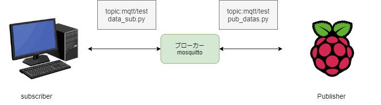

# raz-pi-dht11-PC  
ラズベリーパイから、dht11の測定データをpcに送るためのコード  
# コンテンツ
1. [前置き](#1.-前置き)
2. [構造](#2.-構造)
3. [使い方](#3.-使い方)

## 1. 前置き
ビッグデータに触ってみたい、自分で用意するのに楽な方法はないかな？と思った時、ラズベリーパイにデータを取得させよう!と思いついた。ゆくゆくはクラウドに保存しておいて、ビッグなデータと適当な問題を機械学習で解決してみる。
## 2. 構造
ラズベリーパイとdht11 を接続して、温度データを取得する。  
MQTTを使用して、パソコンとラズベリーパイを通信する。  
データはjson形式でパソコンに送り、パソコン側でcsvファイルに書き込む。  

## 3 使い方
### 3.1 PCとラズベリーパイで必要なパッケージをインストールする
~~~
pip install requirements.txt
~~~
### 3.2 PCとラズベリーパイにmosquitto をインストールし、起動する
[mosquittoホームページ](https://mosquitto.org/download/)  
 インストールしたら、PC,ラズベリーパイでmosquitto を起動しておく  
 ~~~
 systemctl start mosquitto  -v 
 ~~~ 
 windowsの場合は、mosquitto のインストールされているディレクトリで実行する
  ~~~
 cd C:\Program Files\mosquitto
 mosquitto -v
 ~~~ 
### 3.3 ラズベリーパイ側でcronの設定をする
ラズベリーパイを起動し、適当なディレクトリにdata_sub.pyを設置する。  
また、PCのIPアドレスをdata_sub.py の45行目に書き足す。
1回コードを実行すると1回データを送信して、接続を切るので、crontab で定期的に実行されるようにする。
`/home/pi/reststamp/` にpub_datas.pyを設置した場合は、次の行を書き加え、保存する。10秒に1回pythonコードが実行され、データが送信される。
~~~
crontab -e 

* * * * * for i in `seq 0 10 59`;do (sleep ${i}; python /home/pi/reststamp/pub_datas.py ) & done;
~~~
### 3.4. PC側でdata_sub.pyを動かす。
pc側にdata_sub.pyを設置し、pythonで実行する。  
data_sub.py の15行目のfileNameを設定しないと、data_sub.py があるディレクトリにpath_to_csvfile.csvが生成され、そこにデータが貯められていく。
~~~
python data_sub.py
~~~
